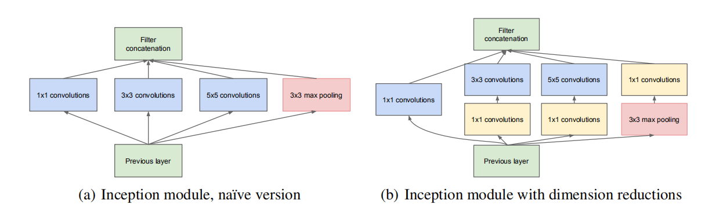
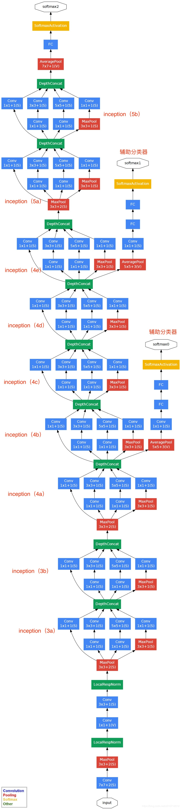

## 1. 1*1 卷积核的作用
1. 降低维度，减少计算瓶颈的发生
2. 增加网络的深度和宽度
3. 更加容易整合到CNN的pipeline上

## 2. 增加网络深度来增加性能缺点
1. 网络越深，参数就越多。容易导致过拟合。尤其是在样本量少的情况下，而且高质量的样本创建是棘手且昂贵的
2. 成倍的增加计算量的

## 3. inception模块
1. module

2. 为什么需要 `1 * 1，3 * 3，5 * 5`的内核

	1. 基于方便考虑而不是必须这个大小，卷积的pad分别是0、1、2，步长都是1。`eg:(7+2*0-1)/1 = (7+2*1-3)/1 = (7+2*2-5)/1 == 6`
	2. 最大下采样可以尽可能的增加原始数据，防止梯度消失 

3. 为什么需要加上1*1过滤器
	1. 5 * 5的卷积核计算量比较大，在前面加上`1 * 1`卷积可以减少卷积的深度

## 4. gooLeNet结构

1. 中间有两个辅助分类器，在训练时，分类器的损失占比0.3；在推断时，直接丢弃两个辅助分类器
2. 4个步长为2的最大下采样；depthConcat就是inception结构的分点