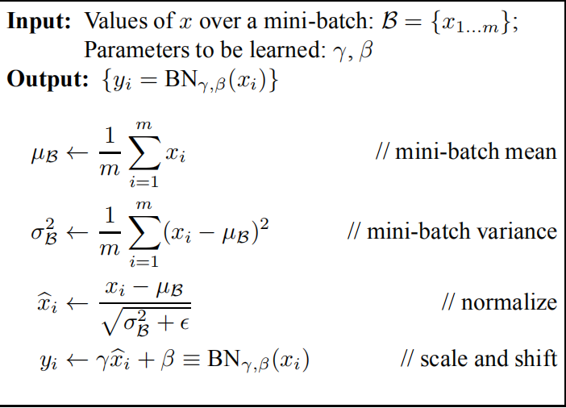
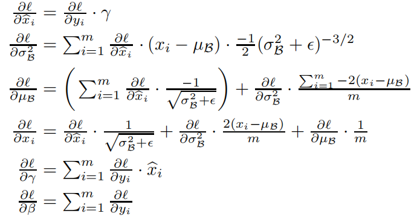
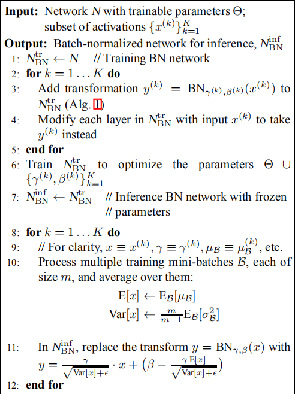

## 1.internal covariate shift 内部协变量漂移
	 由于先前层参数的变化，导致每一次输入数据分布的变化。这导致减慢训练速度以及需要更小的学习率和更加小心的初始化，使得在饱和的非线性区域训练变得困难

## 2. BN batch normalize
1. 梯度饱和和梯度消失问题可以通过ReLU，小心的初始化和很小的学习率来解决
2. BN通过矫正输入数据的均值和方差来把数据拉回到一致，同时也降低了初值的依赖，对dropout的依赖也大大降低
3. ε是防止分母为0，γ，β分别是缩放尺度和偏移量

## 3. bn网络训练过程

1.  