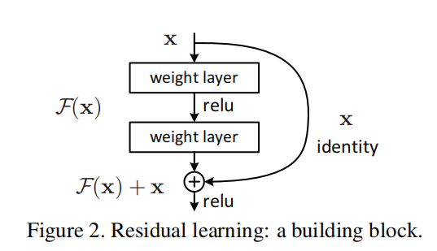

## 1. Is learning better nertwork as easy as stacking more layers?
1. 网络达到一定的深度，梯度开始出现消失或爆炸问题。该问题在很大程度上可以由正则化BN解决。
2. 网络继续加深，会出现训练精度退化问题：随着深度的加深，精度开始饱和然后快速降低，而且退化问题不是由过拟合导致的。
3. 残差网络就是解决训练精度退化问题的

## 2. 残差块

1. 解释：`X`为残差块的输入，`H(X)`为残差块的输出，`F(X)`为卷积的输出，也就是著名的**残差**了。`H(X) = F(X) + X`
2. 残差的意义：去掉相同的主体部分，从而突出微小的变化，让模型集中去学习这些微小的变化
3. 